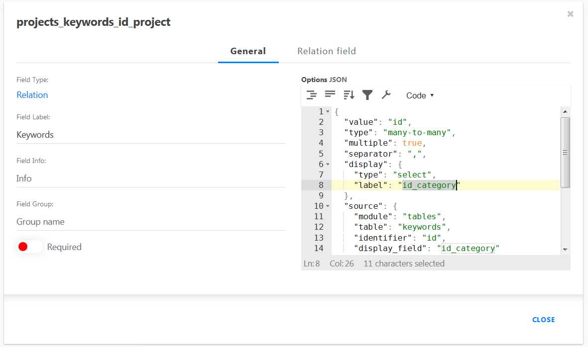

# Cockpit Tables addon - Getting started tutorial

Demo/Tutorial for [Cockpit CMS](https://github.com/agentejo/cockpit) Tables addon (v0.3.0, 2019-11-20)

## Create a basic database schema

Let's start with a database schema with a handful of relations to manage projects and persons.

Persons have a status and a sex (1:m).
One person can be in multiple projects and different persons can be in the same project (m:n).
Projects have keywords (m:n) and the keywords itself have categories (1:m).


[Demo SQL file](data/cptables.sql)

## Install Cockpit with Tables addon

Navigate to your docs root. In this example I use Xampp with PHP7 on a Windows machine.

Create a folder "cptables" and copy all files from Cockpit into it. For simplicity I use `git clone` on the command line with [MSYS/MinGW](https://en.wikipedia.org/wiki/MinGW) (delivered with [Github Desktop for Windows](https://desktop.github.com/)), but you can download the zip file and copy/paste it, too.

```bash
cd /e/xampp7/htdocs
```

```bash
git clone https://github.com/agentejo/cockpit.git cptables
cd cptables
```

Copy the Tables addon into `/path/to/cockpit/addons/Tables`:

```bash
git clone https://github.com/raffaelj/cockpit_Tables.git addons/Tables
```

Create a dummy admin user with password "admin", so you can access Cockpit:

* create a hashed password
* copy the string and create the user

```bash
./cp account/generate-password --passwd admin

./cp account/create --user admin --email test@example.com --passwd '$2y$10$5b8D/MgWFcLam3aOCF6Mo.jnOsfkAblp7xlPPxApkcRJZR6BRZFt.'
```

If your PHP and MySQL server are up and running, you can start using Cockpit. Navigate to your cockpit path in your browser (in my case `http://localhost/cptables`) and login with admin/admin.


Click on the Tables icon. It should look like this:


## Configuration

My [MSYS/MinGW](https://en.wikipedia.org/wiki/MinGW) doesn't have [nano](https://en.wikipedia.org/wiki/GNU_nano), so I have to use [vim](https://en.wikipedia.org/wiki/Vim_(text_editor)) to create the config file. Alternatively create the folder `config` by hand, add a file `config.yaml` and edit it with a text editor of your choice ;-)

```bash
mkdir config
vim config/config.yaml
```

write contents:

```
app.name: Tables Demo

tables:
  db:
    host: localhost
    dbname: cptables
    user: root
    password:

modules.disabled:      
  - Collections
  - Singletons
  - Forms
```

Press <kbd>Esc</kbd>, type `:x` and press <kbd>Enter</kbd> to write and exit vim.

## Database initialization

Reload your browser window. If the connection is successful, it should look like this:


Click on the link "Create tables from database schema".

Your browser window should reload automatically and the auto-guessing mechanism created a basic tables and fields schema.


## Adjust the field schemas

Go through the options of the tables and check the field settings

### Persons (Basic)


If you click on the `1-1` icon, you can change the width of the field.


Now click on the gear icon. The auto-guessing mechanism detected the maxlength and that the field is required:


Ignore the options for now. I only changed the label.


Save, click on "Show entries" and then on "Create an entry". It looks pretty empty.


So, let's go a step back and add some sexes and statuses first.

#### Persons (Advanced)

Go back to the settings of the persons table. Click on the options icon of the `persons_projects_id_person` field and change

```json
"display": {
  "type": "select",
  "label": "title"
},
```

to

```json
"display": {
  "type": "select",
  "label": "title",
  "info": "description"
},
```

Now an info icon with a tooltip containing the project description will be displayed next to the options in the projects select box of a person.

Now let's go a step back and add some sexes and statuses first.

### Sexes and Status

The auto-guessing mechanism had a false positive. It needs some improvements, but it worked good enough in my test cases... The persons table was detected as a m:n helper table between sexes and status. Delete the field, click "Save" and everything is OK.


Do the same in the status options.

I created a few statuses and the sexes "M" and "F".


### Keywords and Categories

The categories look fine. I adjusted the field labels and the field widths.

Now create some categories:


The keywords are OK, too. You can remove the m:n field for projects or keep it and ignore it for once.


Add some keywords:


### Projects

The auto-guessing mechanism was wrong with the field label. Change it from `id_category` to `keyword`:

```json
"display": {
  "type": "select",
  "label": "keyword"
},
"source": {
  "module": "tables",
  "table": "keywords",
  "identifier": "id",
  "display_field": "keyword"
},
```




If you would create your first project entry, it would look like this:


You can select keywords, but they aren't separated by categories, yet.

Add this to the JSON options:

```json
"split": {
  "identifier": "id_category",
  "columns": 3
},
```


Now the categories are beautifully separated into columns of categories.


## Create contents

### First project

Save your first project now and click on "Close". Your projects overview page should look like this.


Your keywords overview page should look like this:


### First person

If you followed all steps above and you create your first person now, it should look like this:


Save your entry.

### Create related contents

While editing a person, you can click on the plus icon next to a select box:


Now a modal opens with the referenced table. Create a second project, save it, the modal closes and save the person.


Persons overview with two persons and two different projects:


